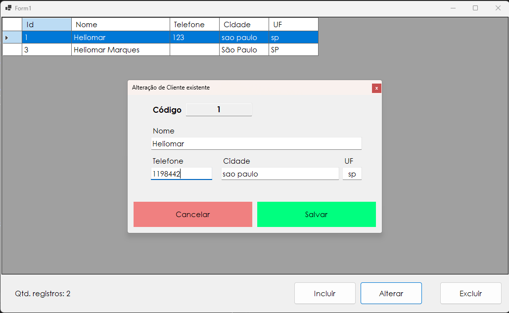

# CRUD Dapper &amp; Sqlite

Este é um projeto de exemplo que demonstra como realizar operações CRUD (Create, Read, Update, Delete) em um banco de dados SQLite utilizando o framework Dapper em uma aplicação .NET Core.

## Funcionalidades:

- Criar, ler, atualizar e excluir registros em uma tabela SQLite.
- Suporte para transações.
- Validação de dados.
- Mensagens de erro amigáveis.

## Pré-requisitos

Certifique-se de ter os seguintes requisitos instalados em sua máquina:

- .NET 7 SDK [Download aqui](https://dotnet.microsoft.com/pt-br/download)
- Um editor de código com suporte ao .NET 7 (Visual Studio, etc.)
- Git (opcional, se você deseja clonar este repositório)
 
## Como usar

1. Clone este repositório:

`git clone https://github.com/heliomarpm/dotNET.CRUD.DapperSqlite.git`

1. Navegue até o diretório do projeto:

`cd dotNET.CRUD.DapperSqlite` 

1. Abra a solução no Visual Studio:

## Tecnologias utilizadas:

- .NET SDK
- Dapper
- SQLite

## Observações:

Este projeto é apenas um exemplo de como usar o Dapper e o SQLite.
Você pode adaptar este projeto para atender às suas necessidades específicas.
Espero que este projeto seja útil para você!

## Contribuindo
Contribuições são bem-vindas! Sinta-se à vontade para abrir uma issue para relatar problemas, sugerir novas funcionalidades ou enviar um pull request.

## License

[MIT © Heliomar P. Marques](LICENSE) <a href="#top">🔝</a>